# 🚀 Django  

## 📌 About  
A repository for uploading my work done through Courses related to the Django Web Framework.  
  
_**Commit#1**_  
Initial Commit uploaded all the files from the Local Client.  

---  
  
_**Commit#2**_  
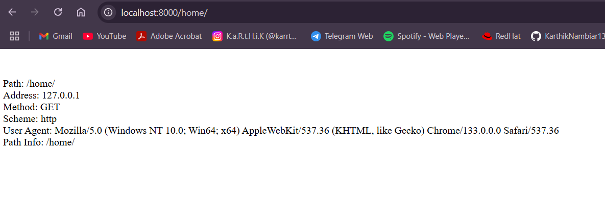  
Changes made to urls.py and views.py in myapp to demonstrate request parameter in the user defined function inside the views.py(myapp) and used certain constants to be rendered into the Html Repsonse.  

---  
  
_**Commit#3**_  
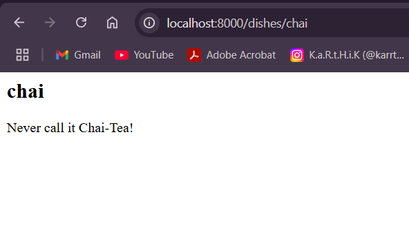  
Added /dishes endpoint, which uses string after it to show the corresponding details of the dish name in the parameter.  

---  

_**Commit#4**_  
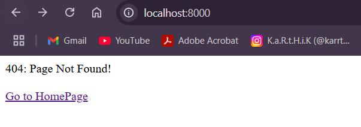  
Added Custom Error Handling. Exception Handling done in views of the project folder specifically for 404 status code, and provided a link to redirect users to home page.  

---  

_**Migration in Django**_  
Commit 5 - A simple example program uploaded, in which there are files which are created using the makemigrations, and migrate commands.  

---  

_**Foreign Key**_  
Commit 6 - Used two models, Menu Category and Menu. These two models are linked together using a Foreign Key.  
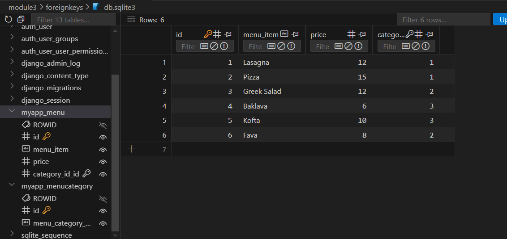
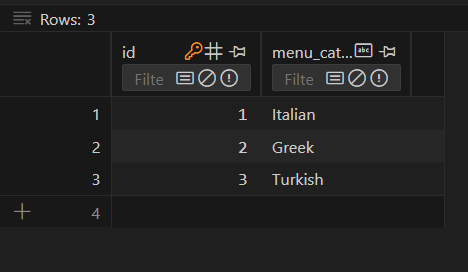  
Django-admin endpoint was used to insert data into these models/tables as django-admin provides a very smooth interface for the user.  
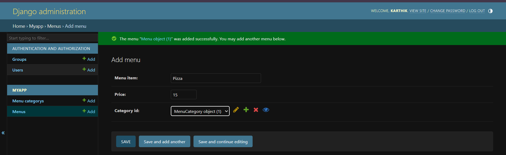  

---  

_**Object-Relational Mapping**_  
Commit 7 - Studied about ORM which helps us perfrom SQL Query without actually writing the SQL Queries. There are certain set of commands or functions or methods provided by Django to perform SQL Queries. In this particular example, I explored the Django.object.filter() method which acts equivalent to the SELECT * FROM table_name WHERE condition query of SQL.  

---  

_**Forms**_  
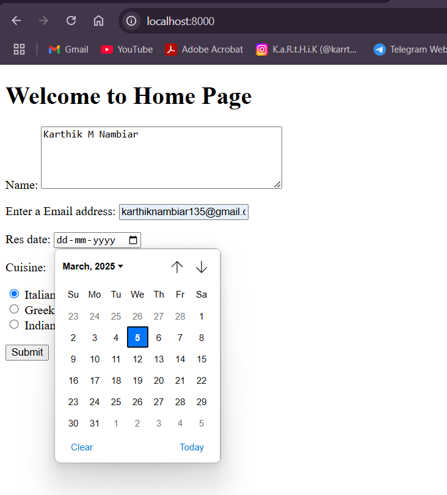
Commit 8 - Studied about forms in Django and how we can use different attributes to create Forms using Classes in forms.py inside app. Here, as an example i created a simple form with textbox, email field, date object and finally a multiple choice option with Radio Buttons(By Default, choices are displayed as a drop down list).  

Commit 9 - Another Forms example  
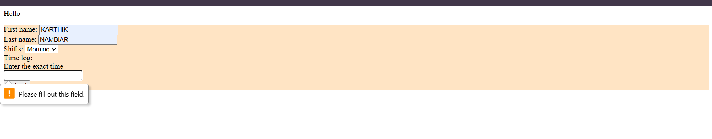  

Commit 10 - We used models and then imported it into the forms.py and submitting the form logs the POST method in the terminal. Also, after the necessary migrations, the data is automatically stored into the model/table whenever we hit submit with the required data filled into the form.  
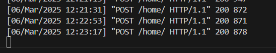
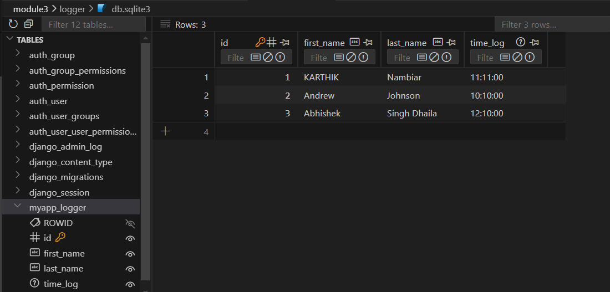  

---  

_**Django Admin**_  

Commit 11 - Django Admin panel which is accessed by the admin/ endpoint helps us manage permissions for the models and database in a Django Framework. Here, we can also add records into the table without having to use SQL Queries. Also, for easy identification of the entered records, a record can be shown with any of their attribute name instead of object based name using the __str__() method inside the class specified in models.py, for example, Employee.object(1), can be represented as 'Priya' which can be first_name attribute.  

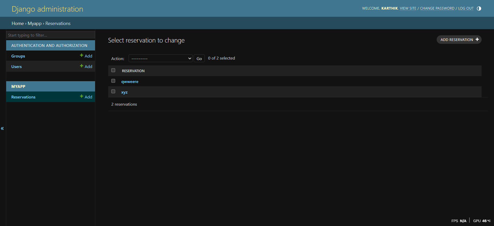  
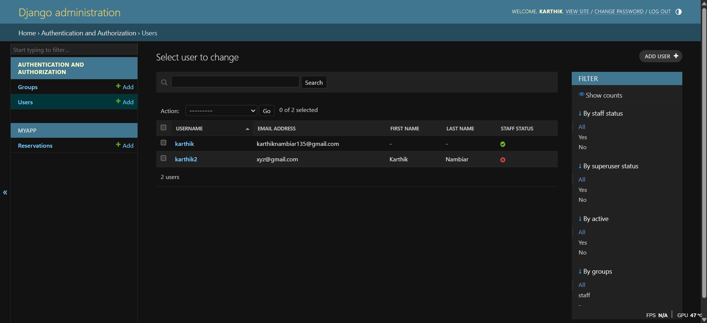
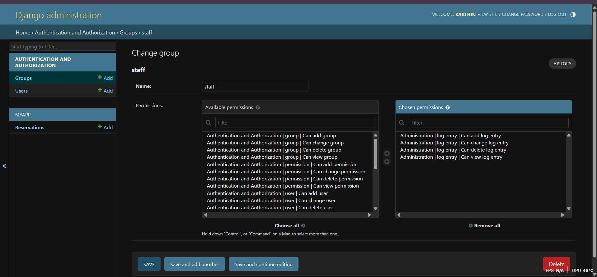  

Furthermore, groups and users can also be added and removed using the django-admin panel.  
NOTE: To access the django-admin panel, one should create a superuser using the terminal, and using that login credentials, we can access this admin panel by https://127.0.0.1:8000/admin  

---  

_**SQL**_  
Commit 12 - We can use SQL databases, using MySQL, Postgres etc, and use the terminal to create users, and connect that database to our frameworks.  
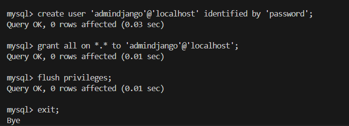  
After creating databases, we need to edit the settings.py file to match our database name, host, port, username and password.  
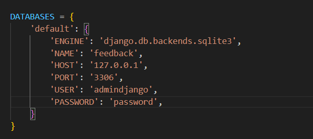  
Finally, after running the required migrations, we can see that a database named according to our created database, (here, it is 'feedback') is created in our project directory.  
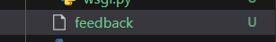 

---  

_**Rendering Templates**_      
Commit 13 - We can dynamically Render Templates using the DTL, which is, Django Template Language, by editing the data inside views and rendering it into the template file without actually modifying the html file.  
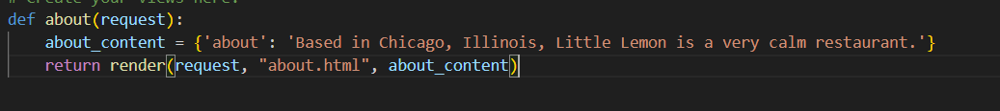 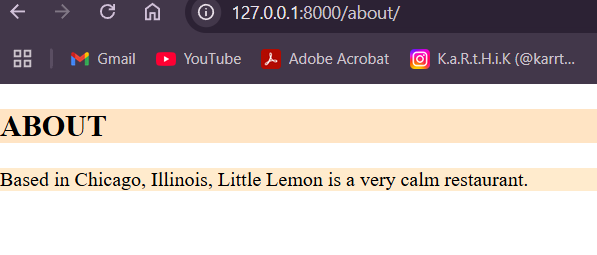  

Commit 14 - Using Variables and Tags such as for loop in DTL to render templates dynamically.  
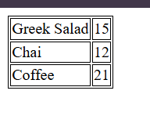 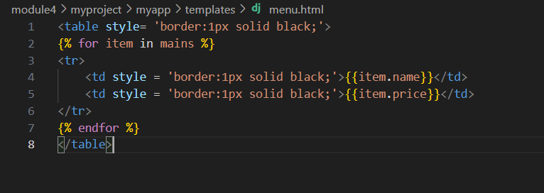  

Commit 15 - Using models and rendering those models to the html template.  

First we created the model as usual.
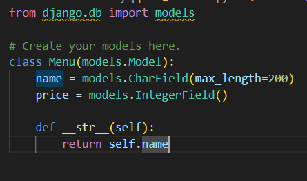  

Then, we imported the model to the view and created a view function to render the model to the template.  
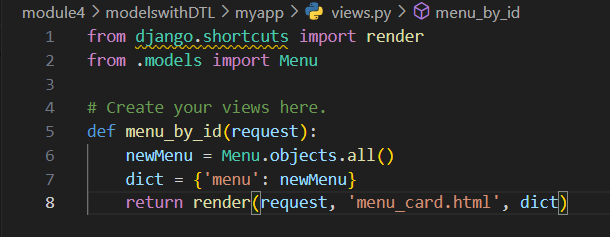  

Furthermore, we used DTL in the html file to check whether menu exists using if-else conditional statement, and used for loop to iterate over the fields in the model.  
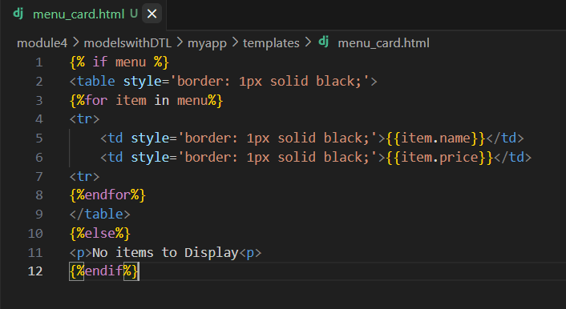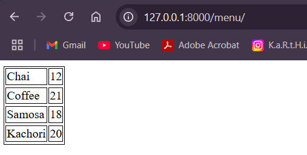  

Commit 16 - Using extends and include tags to implement the DRY principle, which is, DONT REPEAT YOURSELF. extends tags inherits from the parent template into the child template, while include tag just includes the particular template.  
Here, extends tag is used to inherit from base.html, hence all the html files have the same style as base.html, and only the specified update in the paragraph tag changes.  
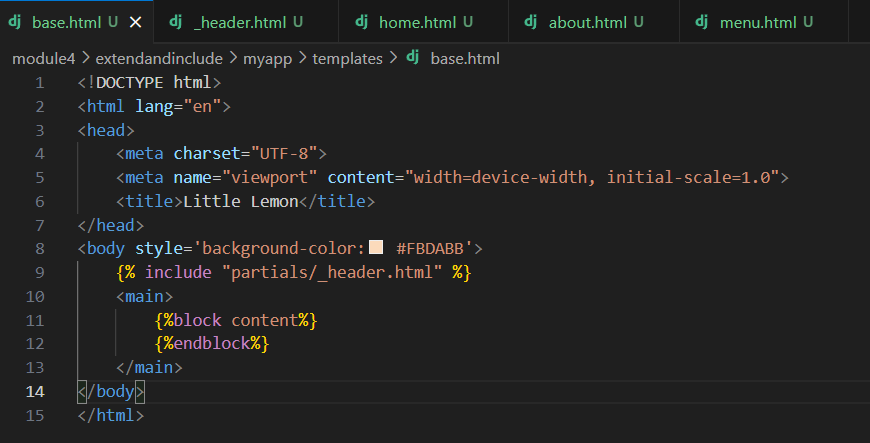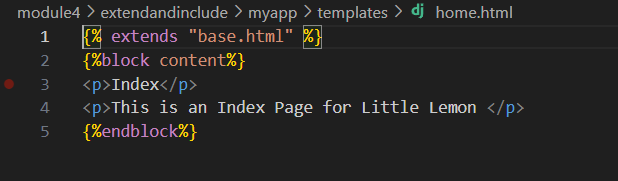  
Also, the include tag in base.html includes the header from the _header.html, which is also inhertied by all the other html files.  
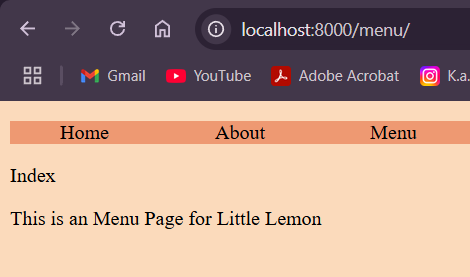  